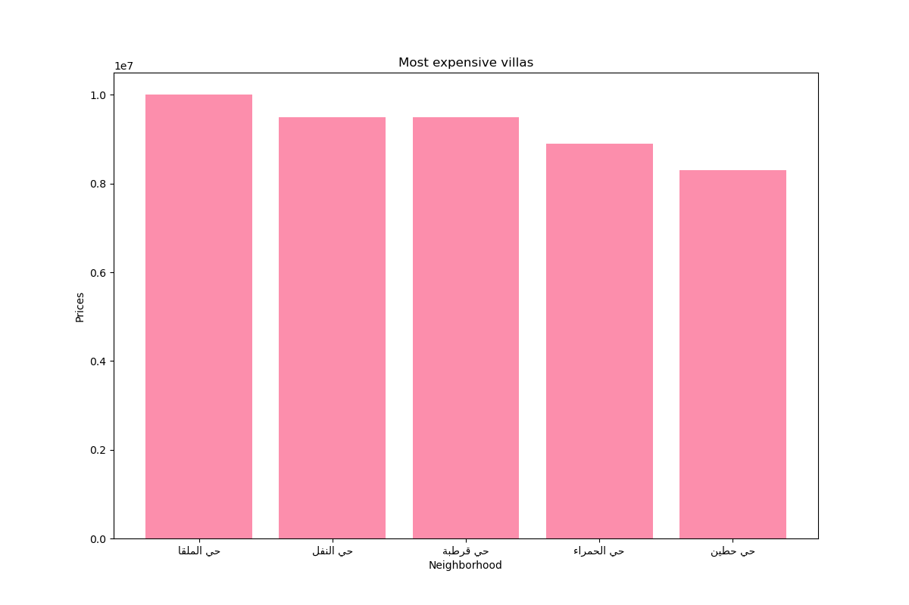
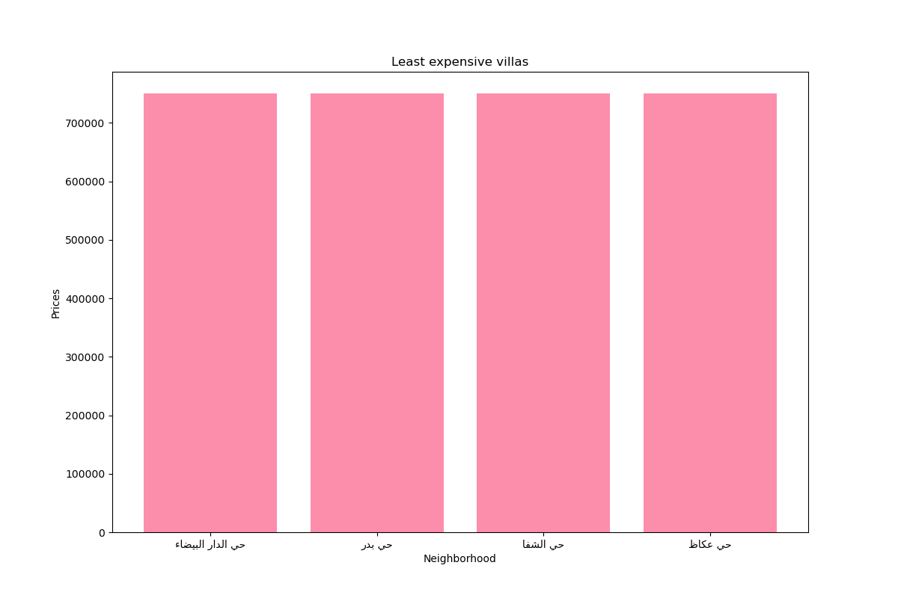
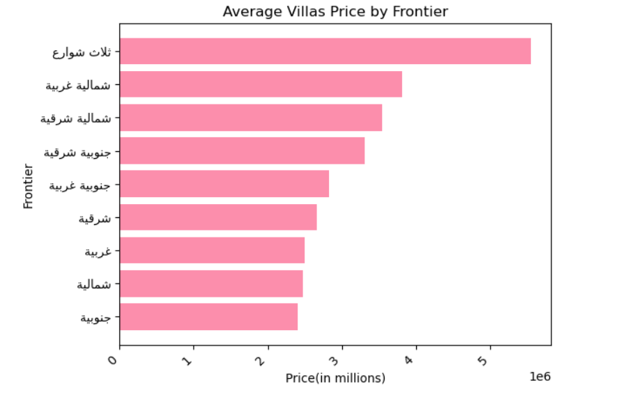
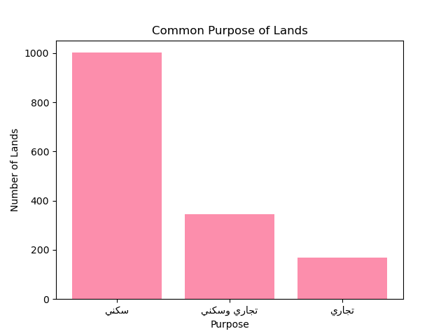
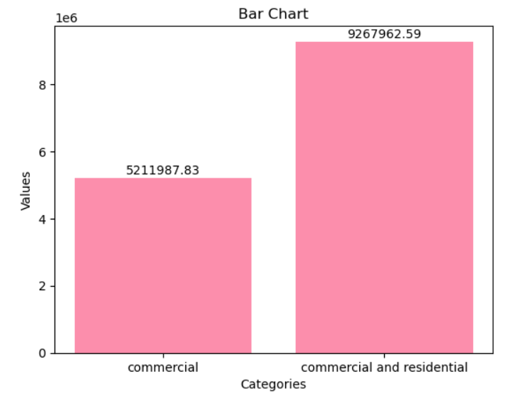
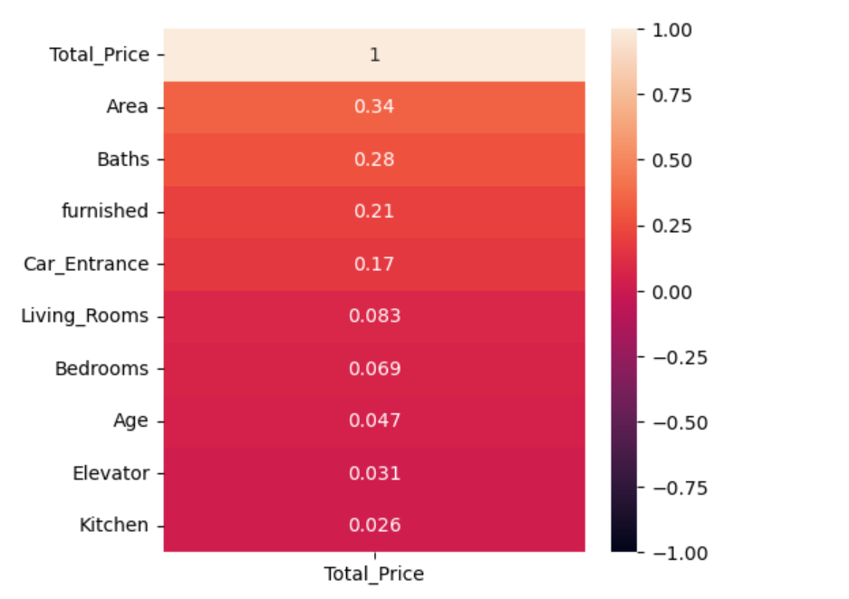
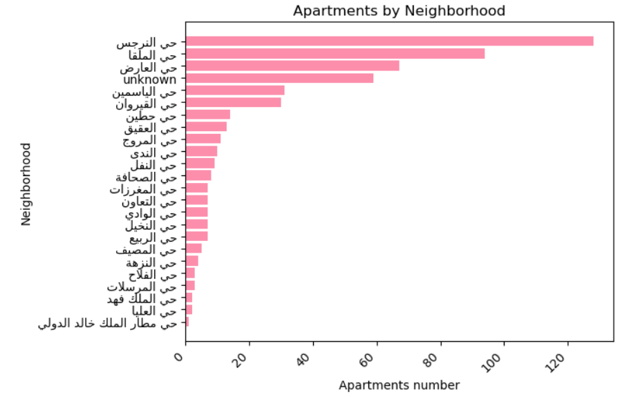
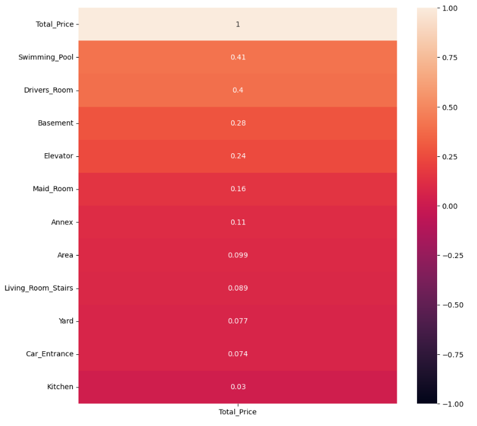

# Analysis on Real Estate Dataset

Navigating Riyadh's real estate market can be challenging due to limited data. We provide an analysis of information on villas, apartments, and lands to offer valuable insights for anyone exploring real estate opportunities in Riyadh.

## Objective Questions

Our objective questions for the datasets are:

1. In what neighborhood are the most expensive and least expensive villas located?
2. Does the frontier location of a villa can affect its price?
3. What factors influence the price of villas?
4. What factors influence the price of apartments?
5. What are the average prices of lands intended for investment purposes?

## Dataset Overview

The dataset is divided into three parts:

- **Apartments:**
  - Columns: Property_Type, City, Neighborhood, Facade, Bedrooms,Living_Rooms, Baths,Area, Kitchen, Car_Entrance, Elevator, Floor, Age, furnished,Total_Price.

- **Villas:**
  - Columns: Property_Type, City, Neighborhood, Facade, Bedrooms, Living_Rooms, Baths, street width, Area, Living_Room_Stairs, Kitchen,Maid_Room, Drivers_Room, Annex, Yard, Swimming_Pool, Basement, Car_Entrance, Elevator, Total_Price.

- **Lands:**
  - Columns: Property_Type, Purpose, City, Neighborhood, Facade, Area, Price_per_Meter, Total_Price.
    
## Source of the Dataset

The dataset was first introduced by the user "MyFaisal" as the owner on a Kaggle repository, without specifying the data collection steps or the source.

## Exploratory Data Analysis (EDA)

The EDA steps taken in this project include:

1. **Reliability:** 
   The data is from Kaggle, and there is no specific source. However, since our objective is for learning, we can use it.

3. **Timeliness:** 
   The data was last updated 10 months ago.

4. **Consistency:**
   There are inconsistent values, especially in the City and Neighborhood columns.

6. **Relevance:**
   The available data is consistent with the objectives of the analysis.
   There are irrelevant columns in all the datasets that we dropped, such as Property_Type.

8. **Completeness:**
   All three datasets (Lands, Villas, Apartments) had missing values.
   In the Lands dataset, missing values in the "Purpose" column were filled using imputation with the mode.
   In the Villas dataset, for the "street width" column, due to the large number of null values, we decided 
   to drop the column, and because there were many missing values in other different columns, we chose to create two DataFrames: one with the missing values and one 
   without, depending on the purpose.
   In the Apartments dataset, missing values in the "Neighborhood" column were filled using imputation with the constant value 'unknown'. Missing values in the 
   "Living_Rooms" column were filled with the constant value '1', based on a new order by the Saudi Arabia government requiring at least one living room. One 
   missing value in the "Age" column in the Narjis neighborhood was filled using imputation with the mean value for the Narjis neighborhood, which is '4'. As for the 
   "Floor" column, due to the large number of null values, we decided to drop the column, as it wouldn't significantly affect the final results, and because there 
   were many missing values in other different columns, we chose to create two DataFrames: one with the missing values and one without, depending on the purpose.
   
10. **Uniqueness:**
    All three datasets (Lands, Villas, Apartments) had duplicate rows, but we decided to keep them since they may represent different values, and there are no unique 
    identifiers to confirm they are true duplicates.
    
12. **Accuracy Check:**
    12\.1. Data Type: In In Villas and Apartments datasets, we converted the "Bath" column from object to int, 
    and for the ["Kitchen", "Car_Entrance", "Elevator", "Furnished"] columns, we changed the data type from int to category. The Lands dataset remains the same.
    12\.2. Outlairs 
    

## Key Insights

From our analysis, we gained significant insights related to the data:

1. The chart indicates that the most expensive villas are situated in the northern and eastern parts of Riyadh.
  
2. According to the chart, the least expensive villas are found in the southern region of Riyadh.
  
3. Many of the costly villas are located at the intersection of three streets.
  
4. We can notice that 60% of people purchase land for residential purposes.
   
5. The data suggests that land for commercial purposes is more expensive than land designated for both commercial and residential use. Therefore, if you are looking for a less expensive investment, option for land with a combined commercial and residential designation might be more economical.
   
6. Furnished apartments tend to be more expensive than unfurnished ones.
   
7. The data reveals that the area is a significant factor influencing the price of an apartment, which makes logical sense.
   
8. We noticed from the data that most selling apartments are loctaed in Alnarjes neighborhood.
   
9. [Insight 9 with the chart]
    
10. [Insight 10 with the chart]
    

## Storytelling Link

[Take a look at our Storytelling](https://usecase6-project3-hatoon-group.streamlit.app/)

## Team Members

- Dania Alshehri
- Faisal Alzhrani
- Fahad Alsaadi
- Ashwaq Almalki
- Hatoon Aloqaily
